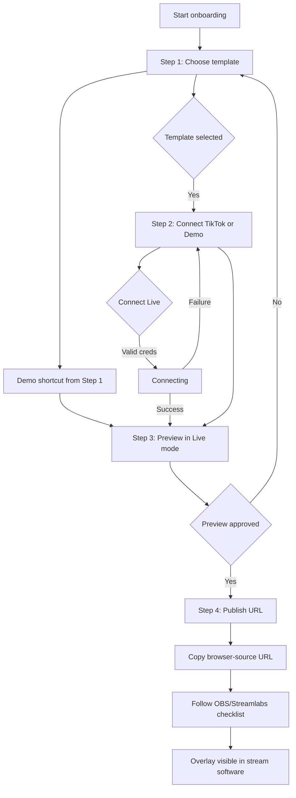

# IKI-109 — Onboarding & Activation v2: BA Requirements

> Document type: Business / Functional requirements  
> Author role: Business Analyst  
> Parent initiative: IKI-109 Onboarding & Activation v2 — first published overlay under 15 minutes  
> Child issue: IKI-122  
> Status: Ready for Product Owner backlog/prioritization and Engineering implementation handoff  
> Scope: Requirements only — no code implementation in this document

## 1. Executive summary

Onboarding & Activation v2 turns the current multi-page Stream Studio setup into one linear, first-run flow:

1. Choose template.
2. Connect TikTok live or choose Demo.
3. Preview.
4. Publish a browser-source URL.

The primary business outcome is **first published overlay under 15 minutes**. The flow must allow a user to reach Demo mode from **step 1 without entering a TikTok username or API key**, then publish a working browser-source URL into OBS or Streamlabs.

This document defines the business intent, functional requirements, use cases, business rules, validation, error/empty states, edge cases, browser-source URL integrity, and Demo/Live transition behavior for Engineering.

## 2. Business objectives

| ID | Objective | Measure |
| --- | --- | --- |
| BO-01 | Reduce time from first visit to first published overlay | Target: under 15 minutes |
| BO-02 | Remove credentials as a blocker for trying the product | Demo reachable from step 1 with no API key |
| BO-03 | Reduce publish errors in OBS/Streamlabs | Clear checklist + copy-paste browser-source instructions |
| BO-04 | Prevent misleading live/demo states | Explicit mode label in builder, preview, publish, and overlay |
| BO-05 | Protect user-supplied credentials and generated URLs | URL integrity, masking, and warning requirements |
| BO-06 | Keep the v2 path simple and predictable | Exactly 4 steps; advanced builder remains a separate path |

## 3. Scope

### 3.1 In scope

- 4-step onboarding wizard requirements for template selection, connection, preview, and publish.
- Demo mode entry from step 1 without credentials.
- Live connection via TikTok username + API key.
- Browser-source URL generation and integrity requirements.
- OBS/Streamlabs checklist and copy-paste instructions.
- Use cases, business rules, validation, error/empty states, and edge cases.
- Demo/Live mode transition rules.

### 3.2 Out of scope

- Backend implementation, authentication, API-key storage design, or third-party API changes.
- Full drag-and-drop widget editor redesign.
- Template authoring or new template asset creation beyond the existing catalog.
- OBS/Streamlabs desktop application code.
- Production deployment or QA execution.

### 3.3 Assumptions

- The existing template catalog (`Hallmark Classic`, `Goal Crusher`, `Alert Pop`) remains available for v2.
- The published overlay continues to use the `/overlay?config=...` browser-source model, unless Engineering determines a safer opaque-ID model is required.
- `tik.tools` remains the current API-key/WebSocket provider for live mode.
- The onboarding flow can be served from the same web origin as the published overlay.

## 4. Current-state gaps observed

| Area | Current behavior | Required v2 behavior |
| --- | --- | --- |
| Template choice | Template Gallery is separate; Builder auto-loads a classic preset | Step 1 of onboarding explicitly selects one template |
| Demo entry | Demo is available on `/live` and via builder publish fallback | Demo must be reachable from step 1 without API key |
| Connection | Separate `/live` page with manual fields | Step 2 of onboarding, inside the wizard |
| Preview | Builder canvas is the preview/editing surface | Step 3 provides a dedicated pre-publish preview |
| Publish | Toolbar popover produces URL + short OBS hint | Step 4 includes URL, copy action, and full OBS/Streamlabs checklist |
| Mode semantics | URL with missing creds silently starts Demo | Mode is explicit; live failure does not silently masquerade as demo |

## 5. Target process flow

## 6. Functional requirements

### 6.1 General flow

- **FR-001** The onboarding flow must present exactly four steps in order: template, connection, preview, publish.
- **FR-002** Each step must show a progress indicator with the step number, title, and completion state.
- **FR-003** The system must allow navigation backward to previous completed steps without losing valid selections.
- **FR-004** The system must not allow forward navigation when the current step is incomplete or invalid.
- **FR-005** The system must preserve the selected template, selected mode, and live inputs while moving between steps during one session.
- **FR-006** The system must provide a single primary action per step and clearly distinguish secondary actions.
- **FR-007** The system must show a persistent mode badge in step 2, step 3, and step 4: `Demo`, `Live`, `Connecting...`, or `Not connected`.

### 6.2 Step 1 — Choose template

- **FR-101** Step 1 must display the available templates with name, short description, feature tags, and a visual preview or thumbnail.
- **FR-102** The system must require exactly one template selection before continuing.
- **FR-103** The default state must have no template pre-selected; the CTA is disabled until selection.
- **FR-104** Selecting a template must immediately highlight it and enable the primary CTA.
- **FR-105** The primary CTA for a selected template must be `Gunakan Template` / `Use Template`.
- **FR-106** Step 1 must expose a visible secondary action to enter Demo mode without an API key, such as `Langsung Coba Demo` / `Try Demo Now`.
- **FR-107** The Demo shortcut must be available before the user reaches step 2 and must not require username or API-key input.
- **FR-108** Choosing the Demo shortcut must use the currently selected template. If no template is selected, the system must prompt the user to select one first.
- **FR-109** Choosing the Demo shortcut must set mode to Demo and advance directly to step 3 Preview, skipping the credential fields in step 2.
- **FR-110** Step 1 must include a secondary action to return to the previous entry point or close onboarding.

### 6.3 Step 2 — Connect TikTok Live or Demo

- **FR-201** Step 2 must present two mutually visible paths: Live connection and Demo mode.
- **FR-202** The Live path must contain two fields: `TikTok Username` and `API Key`.
- **FR-203** The Live path must validate username and API key when the user attempts to connect.
- **FR-204** The system must strip a leading `@` from the username before validation and connection.
- **FR-205** The API-key field must provide a link or hint to obtain a key from `tik.tools`.
- **FR-206** The Demo path must be selectable without entering any credentials.
- **FR-207** Choosing Demo in step 2 must set mode to Demo and allow the user to continue to step 3.
- **FR-208** When Live connection succeeds, the system must set mode to Live, show `Live`, and enable continue to step 3.
- **FR-209** When Live connection fails, the system must keep the user on step 2, show the specific error, and preserve the username input for correction.
- **FR-210** The system must not allow continue to Live preview while the Live connection state is `Connecting...` or `Error`.
- **FR-211** The system must provide a `Back` action to return to step 1.
- **FR-212** The system must provide a `Demo` action as an alternative when Live connection fails or the user declines to enter credentials.

### 6.4 Step 3 — Preview

- **FR-301** Step 3 must render a 9:16 preview of the selected template using the selected mode.
- **FR-302** In Demo mode, the preview must use simulated data and display a visible `Demo` watermark or label.
- **FR-303** In Live mode, the preview must use the connected TikTok stream and display a `Live` status when connected.
- **FR-304** The preview must be interactive enough to verify that widgets, layout, and event display are working.
- **FR-305** If Live mode is selected but not connected, the system must return the user to step 2 or offer a Demo fallback.
- **FR-306** Step 3 must provide `Ganti Template` / `Change Template` returning to step 1.
- **FR-307** Step 3 must provide `Ubah Koneksi` / `Change Connection` returning to step 2.
- **FR-308** Step 3 must provide a primary `Lanjut ke Publish` / `Continue to Publish` action.
- **FR-309** The primary publish action must be enabled only when a template is selected and either Demo is active or Live is connected.
- **FR-310** The preview must not expose the full API key in the UI.

### 6.5 Step 4 — Publish URL

- **FR-401** Step 4 must generate one canonical browser-source URL for the selected template, layout, and mode.
- **FR-402** The URL must use the current web origin and an absolute path so it can be pasted into OBS/Streamlabs.
- **FR-403** The system must display the generated URL in a read-only, selectable, wrap-friendly field.
- **FR-404** The system must provide a `Salin URL` / `Copy URL` button with a visible `Tersalin` / `Copied` confirmation.
- **FR-405** If clipboard access fails or is denied, the system must allow manual selection and copying.
- **FR-406** The system must provide `Buka Preview` / `Open Preview` to open the generated URL in a new tab or window.
- **FR-407** Step 4 must display the OBS/Streamlabs checklist and copy-paste browser-source instructions.
- **FR-408** The system must show whether the generated URL is in Demo or Live mode.
- **FR-409** For Live mode, the system must warn the user that the URL may contain a credential and must not be shared publicly or shown on stream.
- **FR-410** Changing template or mode after publishing must generate a new URL; the previously generated URL remains usable until it is intentionally invalidated.
- **FR-411** Step 4 must provide `Kembali Edit` / `Back to Edit` to return to step 3 or step 1.

### 6.6 Browser-source URL integrity

- **FR-501** The URL must be generated by the application from a serialized configuration object, not assembled from free-text user input.
- **FR-502** The system must encode the overlay configuration in a URL-safe format that preserves Unicode values such as emoji.
- **FR-503** The published overlay must decode the configuration safely and must not crash on malformed, truncated, or legacy URLs.
- **FR-504** If the configuration is invalid or empty, the overlay must render a readable error state with a `Reload` action and instructions to regenerate the URL from the onboarding flow.
- **FR-505** The overlay must honor the encoded mode explicitly: `demo: true` starts Demo; Live credentials start Live.
- **FR-506** The overlay must not silently switch from Live to Demo when Live credentials are present but the connection fails.
- **FR-507** The overlay must not log the full configuration or API key to browser console or analytics.
- **FR-508** Generated URLs must not be inserted into visible page copy that could be captured by stream output without user action.
- **FR-509** The system must detect and block config values that are not valid template IDs, numeric percentages, or known mode values.
- **FR-510** The published overlay must be standalone, transparent-background ready, and work without app chrome.

## 7. Use cases

### UC-01 — Choose template and start Demo from Step 1

- Actor: New streamer.
- Precondition: User opens onboarding and template catalog is loaded.
- Main flow:
  1. User reviews template cards.
  2. User selects one template.
  3. User clicks `Langsung Coba Demo`.
  4. System sets mode to Demo and advances to Preview.
- Alternate flow:
  - 3a. No template selected: system shows inline prompt `Pilih template dulu.` and stays on step 1.
- Postcondition: A template is selected; mode is Demo; no username or API key has been entered.

### UC-02 — Connect Live with username and API key

- Actor: Streamer with a TikTok account and `tik.tools` API key.
- Precondition: User selected a template in step 1.
- Main flow:
  1. User clicks `Gunakan Template` and reaches step 2.
  2. User enters TikTok username and API key.
  3. User clicks `Hubungkan`.
  4. System validates, connects, and shows `Live`.
  5. User clicks `Lanjut` to Preview.
- Alternate flow:
  - 4a. Validation fails: system shows field-specific error and stays on step 2.
  - 4b. Connection fails or times out: system shows connection error, preserves username, and offers retry or Demo.
- Postcondition: Mode is Live and connected; selected template is ready for preview.

### UC-03 — Use Demo from Step 2 without credentials

- Actor: Streamer who wants to preview without live access.
- Precondition: User is on step 2.
- Main flow:
  1. User clicks `Gunakan Demo`.
  2. System sets mode to Demo without touching username/API-key fields.
  3. User continues to Preview.
- Postcondition: Mode is Demo; no credentials are required or sent.

### UC-04 — Preview template

- Actor: Streamer.
- Precondition: Template selected and mode resolved.
- Main flow:
  1. System renders the selected template in a 9:16 preview.
  2. System simulates events in Demo or shows live events in Live.
  3. User verifies widget behavior.
  4. User clicks `Lanjut ke Publish`.
- Alternate flow:
  - 1a. Live not connected: system returns user to step 2.
  - 1b. Template config invalid: system shows error and link to choose template again.
- Postcondition: User approves the preview and proceeds to publish.

### UC-05 — Publish browser-source URL and copy instructions

- Actor: Streamer.
- Precondition: Preview is valid.
- Main flow:
  1. User reaches step 4.
  2. System generates the browser-source URL.
  3. User clicks `Salin URL`.
  4. System copies URL and confirms.
  5. User follows OBS/Streamlabs checklist.
  6. User pastes URL into browser source.
- Alternate flow:
  - 3a. Clipboard unavailable: system shows manual copy instruction.
  - 5a. User edits template: system generates a new URL.
- Postcondition: User has copied a usable URL and has the required setup checklist.

### UC-06 — Switch Demo to Live or Live to Demo

- Actor: Streamer.
- Precondition: User is in Preview or returned to Step 2.
- Main flow Demo to Live:
  1. User clicks `Ubah Koneksi`.
  2. User enters valid credentials and connects.
  3. System switches from Demo to Live and refreshes preview.
- Main flow Live to Demo:
  1. User clicks `Ubah Koneksi`.
  2. User chooses Demo.
  3. System disconnects Live and starts Demo with a visible Demo label.
- Postcondition: Mode label and generated URL reflect the new mode; old event feed is reset.

## 8. Business rules

- **BR-001** A template selection is required for any publish or preview.
- **BR-002** Demo mode never requires a TikTok username or API key.
- **BR-003** Live mode requires both a valid username and a non-empty API key.
- **BR-004** A URL may be published only when mode is Demo or Live-connected.
- **BR-005** A connection attempt that is still pending or failed cannot proceed to Live preview.
- **BR-006** The system must show the actual mode at all times; a failed Live connection is not Demo.
- **BR-007** Entering Demo mode while Live is connected disconnects Live and clears the live feed.
- **BR-008** Entering Live mode while Demo is active stops the Demo generator and clears simulated feed data.
- **BR-009** The same template, layout, and mode produce the same overlay until the user changes them.
- **BR-010** Malformed overlay URLs must fail safe into a recoverable error, never into a blank screen or unexpected Demo.
- **BR-011** Credentials must be masked in UI after entry and not written to logs, analytics, or support diagnostics.
- **BR-012** The app must warn the user before copying a Live URL that contains embedded credentials.
- **BR-013** OBS/Streamlabs instructions must be visible on step 4 without requiring a separate help center.
- **BR-014** The 15-minute target must be supported by a default template-first flow with no mandatory account/workspace setup.

## 9. Input validation

### 9.1 TikTok username

| Rule | Requirement |
| --- | --- |
| USR-01 | Required for Live mode |
| USR-02 | Trim leading/trailing whitespace |
| USR-03 | Strip one leading `@` before validation and storage |
| USR-04 | Length 2–24 characters after normalization |
| USR-05 | Allowed characters: letters, numbers, underscore, period |
| USR-06 | Reject spaces, symbols other than `_` and `.`, and control characters |
| USR-07 | Error copy: `Masukkan username TikTok yang valid.` |

### 9.2 API key

| Rule | Requirement |
| --- | --- |
| KEY-01 | Required for Live mode |
| KEY-02 | Trim leading/trailing whitespace |
| KEY-03 | Must be non-empty after trim |
| KEY-04 | Suggested range: 8–256 characters |
| KEY-05 | Reject spaces and control characters |
| KEY-06 | Mask field as password-style input |
| KEY-07 | Error copy: `Masukkan API key (atau pilih Demo).` |

### 9.3 Template and mode

| Rule | Requirement |
| --- | --- |
| TPL-01 | Must match one known template ID from the catalog |
| TPL-02 | If template list is empty, show retryable system error |
| MOD-01 | Mode must be one of `idle`, `demo`, `live` |
| MOD-02 | A publish action is invalid while mode is `idle` or `live`-pending/failed |

## 10. Error and empty states

| State | Where | Required behavior |
| --- | --- | --- |
| No template selected | Step 1 | CTA disabled; inline helper text on Demo shortcut if clicked |
| Template list empty / load failed | Step 1 | Show `Template tidak tersedia.` with `Coba Lagi` retry |
| Username empty or invalid | Step 2 | Field-level error under username; do not attempt connection |
| API key empty for Live | Step 2 | Field-level error under API key; suggest Demo |
| Live connection timeout | Step 2 | Show `Koneksi timeout. Coba lagi atau gunakan Demo.`; retain username; enable retry |
| Invalid API key or room not live | Step 2 | Show `Gagal terhubung. Periksa username/API key dan pastikan live aktif.` |
| WebSocket error | Step 2 | Show stable error message with retry; do not change mode to Demo |
| Preview config empty | Step 3 | Show `Pratinjau tidak tersedia. Pilih template kembali.` |
| Live selected but not connected | Step 3 | Block publish; return user to step 2 |
| Demo data unavailable | Step 3 | Start with empty/zero states until first simulated event; never blank |
| Publish URL generation fails | Step 4 | Show error with retry; do not display partial URL |
| Clipboard copy denied | Step 4 | Keep URL visible; show `Salin manual: pilih teks lalu salin.` |
| Malformed overlay URL | Published overlay | Show `Overlay tidak valid. Generate ulang URL dari onboarding.` with reload |
| Browser source loads blank | Published overlay | Overlay itself shows config error; OBS checklist includes a reload step |

## 11. Edge cases

- **EC-001** User selects Demo from step 1 with no template: require template selection first.
- **EC-002** User enters credentials, then clicks Demo before connecting: Demo wins; do not send credentials.
- **EC-003** User connects Live, then goes back and changes template: keep or revalidate connection; preview must reflect new template.
- **EC-004** Live connection drops after preview or publish: overlay shows a disconnected/error state and does not impersonate Demo.
- **EC-005** User reloads the onboarding page mid-flow: state may reset; the app must not auto-publish a stale URL.
- **EC-006** User opens an old browser-source URL after config schema changes: overlay must either migrate/ignore unknown fields or show a regeneration error.
- **EC-007** URL contains emoji or non-ASCII props: encoding must survive copy-paste and browser-source parsing.
- **EC-008** User pastes URL into an already-existing OBS browser source: URL replacement must reload the new config without requiring app reinstall.
- **EC-009** User publishes Demo URL, then later connects Live in the same session: system must generate a new Live URL rather than mutate the copied Demo URL.
- **EC-010** API key contains URL-sensitive characters: encode configuration so the generated URL remains valid.
- **EC-011** User copies Live URL and shares it: UI must have warned not to share; Engineering should consider opaque token storage if available.
- **EC-012** No templates are returned by catalog: block flow with retry; do not fall back to blank builder.
- **EC-013** Very long template/widget config produces an oversized URL: system must handle browser-source limits and provide an actionable error if too large.

## 12. Demo/Live transition matrix

| From | To | Behavior |
| --- | --- | --- |
| `idle` | `demo` | Start simulated feed; no credentials required |
| `idle` | `live` | Validate credentials; show `Connecting...`; connect |
| `live-connecting` | `demo` | Cancel pending live connection; start Demo |
| `live-connected` | `demo` | Disconnect Live, stop demo first, clear feeds, set mode to Demo |
| `demo` | `live` | Stop Demo generator, clear feeds, validate/connect Live |
| `live-error` | `demo` | Preserve username, discard current error, start Demo |
| `live-error` | `live` | Retry with corrected/current credentials |
| `live-connected` | `idle` | Disconnect, clear live state; publish is blocked |

## 13. OBS/Streamlabs checklist and copy-paste instructions

### 13.1 Pre-publish checklist

- Confirm step 4 shows the generated browser-source URL.
- Confirm the mode badge matches the intended broadcast mode.
- Confirm the overlay preview works before leaving the app.

### 13.2 OBS Studio browser-source setup

1. Open OBS and select the Scene where the overlay should appear.
2. Click `+` under Sources.
3. Choose `Browser`.
4. Name the source, e.g. `TikTok Overlay`.
5. In `URL`, paste the copied browser-source URL.
6. Set `Width` to `1080`.
7. Set `Height` to `1920`.
8. Set `FPS` to `60` or the stream's chosen overlay frame rate.
9. Keep `Shutdown source when not visible` unchecked unless CPU use requires otherwise.
10. Optional: enable `Refresh browser when scene becomes active`.
11. Confirm the source is visible above gameplay/camera layers as desired.
12. If audio widgets are used, enable browser-source audio in OBS and click once inside the overlay source or use the overlay mute toggle if required.

### 13.3 Streamlabs Desktop browser-source setup

1. Open Streamlabs Desktop and select the target Scene.
2. Click `+` above Sources.
3. Select `Browser Source`.
4. Name the source, e.g. `TikTok Overlay`.
5. Paste the copied browser-source URL into the `URL` field.
6. Set resolution to `1080 x 1920`.
7. Keep `Shutdown source when not visible` unchecked.
8. Enable browser-source audio if audio widgets are used.
9. Position and layer the overlay in the Scene preview.

### 13.4 Post-paste validation checklist

- The overlay is visible with a transparent or intended background.
- Demo mode shows simulated events; Live mode reacts to the live TikTok room.
- There is no console/error text visible to viewers.
- The browser source URL is not shown in a scene, browser bar, or shared screenshot.
- The overlay is not cut off on the target TikTok vertical format.
- Test one event, gift, or chat reaction before going live.

### 13.5 Required copy-paste instruction

The app must show this exact actionable copy on step 4:

> `Salin URL di atas, lalu di OBS/Streamlabs pilih Sources → Browser Source → paste URL → atur 1080x1920.`

## 14. Acceptance criteria traceability

| Acceptance criterion | Covered by |
| --- | --- |
| 4-step flow requirements are complete and unambiguous | Section 6 |
| Use cases cover choose template, connect live/demo, preview, publish URL | Section 7 |
| Demo mode from step 1 is specified without API key | FR-106–FR-109, UC-01, BR-002 |
| OBS/Streamlabs checklist and copy-paste browser-source instructions are specified | Section 13 |
| Business rules, validation, error/empty states, and edge cases are documented | Sections 8–11 |
| Artifact saved at `docs/IKI-109-BA-REQUIREMENTS.md` and final path reported in child issue | Document path + issue comment |

## 15. Open questions for Product/Engineering

- Should v2 onboarding replace `/gallery` and `/builder`, or sit as a new entry point before them?
- Can the published Live URL use an opaque server-side reference instead of embedding the API key?
- Should the flow support widget-level editing after step 3, or keep v2 strictly read-only preview?
- Is the Demo shortcut copy finalized for localization?

## 16. Handoff

- Product Owner: prioritize this requirements baseline against the IKI-109 backlog.
- Engineering: use Sections 6–13 as implementation input; ask BA to clarify any ambiguity before build.
- QA: derive test cases from the use cases, transition matrix, and error/empty-state tables.

