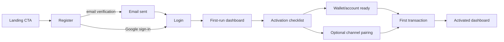
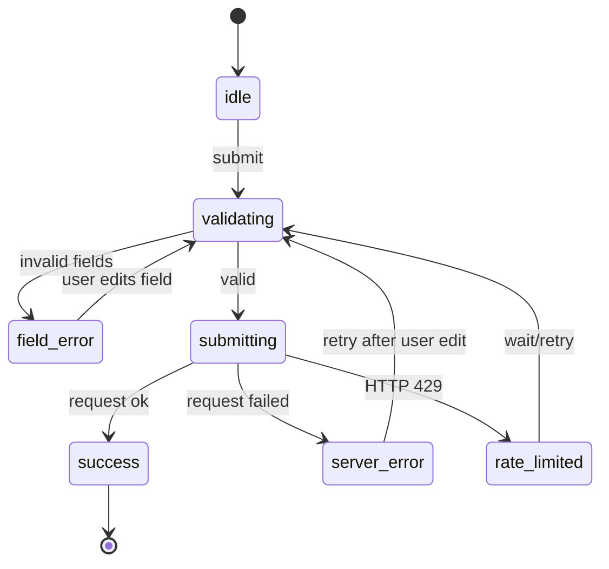
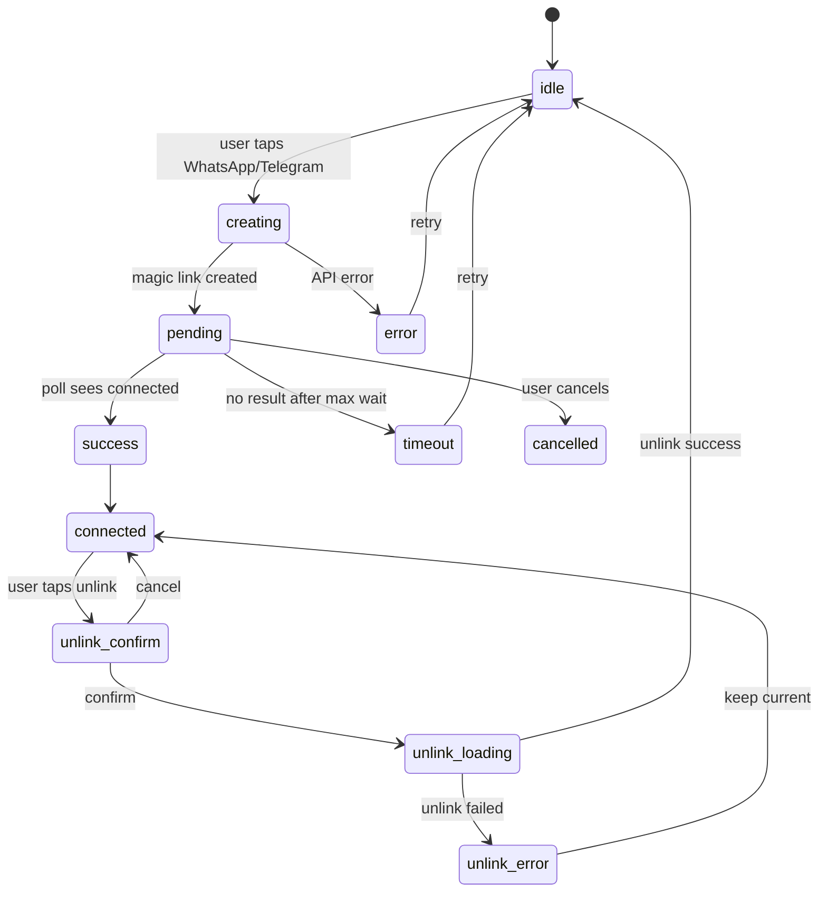

# Sprint 3 — Onboarding, Setup & Empty States Design

> Issue: IKI-67  
> Parent: IKI-56 — Sprint 3 Onboarding & Activation  
> Repo: `/Users/user/Documents/wa-gateway`  
> Status: Draft for implementation handoff  
> Designer: `680f2d50-6b51-4ad5-8638-0cd1f43c7d0e`

## 1. Executive summary

The goal is to reduce friction from **sign up / login → connect WhatsApp or Telegram → first transaction**. The current flows already exist, but they are inconsistent in feedback, accessibility, and mobile handling. This document specifies a state-by-state UI/UX target that implementation can apply without adding Tailwind and without changing the backend contract.

Priority order:

1. Make **auth** legible and resilient: field-level validation, clear error mapping, correct `aria` semantics, one primary action.
2. Make **channel connection** feel safe and observable: explicit `idle / creating / pending / success / error / reconnect` states, timeout, retry, manual fallback.
3. Make **first-run dashboard** useful but not coercive: connection is optional, first transaction and wallet readiness are the required activation steps.
4. Standardise **empty/error/loading** states with existing primitives.

## 2. Scope and non-goals

### In scope

- Register/login/forgot-password/reset-password state design, validation, and error handling.
- WhatsApp/Telegram pairing flow and its pending/success/error/reconnect states.
- Dashboard first-run experience, setup page, activation checklist, and empty states.
- Mobile and accessibility requirements for every state.
- Implementation-ready component, prop, copy, and i18n specifications.

### Out of scope

- Backend implementation, Supabase/OTP/magic-link logic changes, or new APIs.
- Visual brand exploration; the existing design system remains the source of truth.
- Landing page redesign and pricing.
- Final research conclusions from IKI-60; this document uses code-audit evidence and the referenced baseline docs. See Section 13 for the required sync checklist.

## 3. Source material and current-state audit

Audited files:

- `frontend/src/app/login/page.tsx`
- `frontend/src/app/register/page.tsx`
- `frontend/src/app/forgot-password/page.tsx`
- `frontend/src/app/reset-password/page.tsx`
- `frontend/src/app/auth/callback/page.tsx`
- `frontend/src/app/api/auth/register/route.ts`
- `frontend/src/app/api/auth/check-email/route.ts`
- `frontend/src/app/dashboard/setup/page.tsx`
- `frontend/src/app/dashboard/setup/components/*.tsx`
- `frontend/src/app/dashboard/components/ActivationChecklist.tsx`
- `frontend/src/app/dashboard/components/RecentTransactionsActivity.tsx`
- `frontend/src/app/dashboard/components/DashboardState.tsx`
- `frontend/src/app/dashboard/wallets/EmptyAccountState.tsx`
- `frontend/src/app/dashboard/settings/SettingsClient.tsx`
- `frontend/src/app/i18n/auth.ts`
- `frontend/src/app/i18n/dashboard/setup.ts`
- `frontend/src/app/i18n/dashboard/activation.ts`
- `docs/UI_UX_INFORMATION_ARCHITECTURE_*.md`
- `docs/TECH_FLOW_ARCHITECTURE.md`
- `docs/MARKETING_RESEARCH_REPORT.md`

### 3.1 What already works

- Registration uses Supabase public signup with email confirmation enabled and never auto-logs-in when verification is required.
- Password validation is centralised in `frontend/src/lib/passwordValidator.ts` and available on register and reset password.
- Auth routes are proxied by `frontend/src/proxy.ts`; logged-in users are redirected away from `/`, `/login`, and `/register`.
- `/dashboard/setup` supports WhatsApp and Telegram magic-link pairing, polling every 3 seconds, focus/visibility re-polling, unlink confirmation, subscription card, and partner invite.
- `ActivationChecklist` already differentiates required steps from optional channel/budget steps and persists dismissal through `PUT /api/users/activation`.
- The dashboard has reusable `DashboardState` primitives for empty, error, and skeleton states.

### 3.2 Friction and consistency gaps

| Area | Finding | Design direction |
|---|---|---|
| Register/login | Error appears only as a top banner; fields do not expose `aria-invalid` or `aria-describedby` | Field-level errors plus a single page-level summary for server errors |
| Register/login | `Sign in` and `Sign up` buttons lack `aria-busy`/status semantics while loading | Add `aria-busy`, live region, and consistent loading copy |
| Register/login | Email and password inputs do not use `autoComplete` consistently | Use `email`, `current-password`, `new-password`, and `name` correctly |
| Register | Success state replaces the whole form rather than presenting a clear next action | Keep card context, show success state with a primary CTA to login |
| Forgot password | It checks email existence and returns `errEmailNotRegistered` for unknown emails | Preserve privacy, but do not expose account enumeration; always show neutral reset-link-sent messaging |
| Setup page | Uses hand-rolled loading/feedback and hardcoded Indonesian strings in `PhoneInput` | Use i18n tokens and `DashboardState` for load/error; keep one pairing card per platform |
| Pairing | No timeout, no explicit reconnect/expired state, and error banner is disconnected from the affected channel | Add a pairing state machine with `retry`/`manual fallback`/`timeout` |
| Setup page | `OtpPendingView.tsx` exists but the main page does not use it | Either remove the unused file or integrate it into the specified pending card |
| Empty states | Recent transactions empty state is a text-only box; wallets use a separate custom empty state | Standardise visuals, tone, and CTA while preserving wallet-type choices |
| Activation checklist | Error/retry is not explicitly visible; progress only counts two required steps; channel CTA links to settings hub instead of setup | Add explicit retry state, keep optional steps clearly optional, and link channel CTA directly to `/dashboard/setup` |

### 3.3 IKI-60 research alignment

`docs/research/onboarding-activation-audit.md` (IKI-60) is available and maps to this design as follows:

| Research finding | Design response |
|---|---|
| F1 — Post-register verification dead-end | Section 6.4 adds explicit `Buka Email`, `Kirim Ulang Verifikasi` when available, and `Sudah Verifikasi? Masuk Sekarang` |
| F2 — Pairing polls forever; backend token expires in 10 minutes | Section 9.3 defines a 10-minute timeout and expired-token recovery |
| F3 — No visible manual fallback/token/copy during pairing | Sections 9.3 and 9.4 specify token/copy/manual links |
| F4 — Telegram magic-link depends on WhatsApp session health | Section 9.5 records the backend dependency and expected Telegram-only behaviour |
| F5 — First transaction can be blocked by wallet/account auto-heal failure | Sections 11.2 and 11.4 define actionable wallet/account recovery |
| F6 — Activation channel CTA is one hop away | Section 11.1 sets channel CTA to `/dashboard/setup` |
| F7 — Register rate limit can affect shared IPs | Section 6.3 adds rate-limit-specific retry guidance; product decision stays with PM/CTO |
| R1 — Instrument funnel before further UX changes | Section 16 adds measurement events; provider decision is PM/CTO-owned |

## 4. Design principles and constraints

- **Native CSS only.** Do not install or use Tailwind. Prefer CSS Modules for new scoped components; use existing global tokens from `globals.css` and `dashboard.css`.
- **Use existing primitives.** `DashboardPageHeader`, `DashboardState`, `DashboardDialog`, `ConfirmModal`, `Toast`, `AmountInput`, `DatePicker`, and `DashboardRouteSkeleton` are mandatory for dashboard flows.
- **One primary action per view.** Secondary actions should not compete visually with the main CTA.
- **State before decoration.** Every screen must have defined `loading`, `empty`, `success`, `error`, and `disabled` states before visual polish.
- **Mobile-first, desktop enhanced.** All auth/setup flows must work at 320 px; touch targets must be at least 44 px.
- **Accessible by default.** Labels, error semantics, focus order, `prefers-reduced-motion`, and keyboard-only flows are acceptance criteria, not add-ons.
- **Localise all user-facing text.** New strings go in the existing i18n dictionaries; ID and EN must remain in parity because TypeScript enforces the shape.
- **Do not force channel connection.** WhatsApp/Telegram is optional; the required first-run outcome is a usable dashboard and a recorded transaction or a ready wallet.

## 5. User journey and state model

### 5.1 End-to-end journey



### 5.2 Auth state machine



### 5.3 Channel pairing state machine



## 6. Register design

### 6.1 Desktop layout

Keep the existing 432 px card. Move to a reusable auth shell so register/login/reset share padding, logo, and background.

```text
┌────────────────────────────────────┐
|            IKISAE logo             |
|          Daftar Baru               |
|      Cepat dan mudah.              |
|                                    |
| [ Google ]  ← secondary, full width |
|  ─────── ATAU ───────              |
| Nama Lengkap                       |
| [ ................... ]            |
| inline error if invalid            |
| Email                              |
| [ ................... ]            |
| inline error if invalid            |
| Kata sandi baru          [👁]      |
| [ ................... ]            |
| Strength rail + live feedback      |
|                                    |
| [        Daftar          ] primary |
|                                    |
| Sudah punya akun? Masuk            |
└────────────────────────────────────┘
```

### 6.2 Fields and validation

| Field | Type | Rules | `autoComplete` | Error state |
|---|---|---|---|---|
| Full name | text | required, max 120 | `name` | `Nama wajib diisi.` |
| Email | email | required, valid email, lowercase canonical | `email` | `Format email belum valid.` |
| New password | password | `validatePassword(password, email, name)` | `new-password` | Use existing `PASSWORD_ERROR_MESSAGES`/i18n tokens |

Password rules are unchanged:

- 8–128 characters.
- Not a common password.
- Must not contain email local part, full email, or name word.
- No composition restrictions; score is for UI strength only.

### 6.3 Feedback mapping

| Condition | Where | Visual | Copy |
|---|---|---|---|
| Empty required field | inline under field | red text + icon | Field-specific required message |
| Invalid email | inline under field | red text + icon | `Format email belum valid.` |
| Weak/unsafe password | under password input | live strength rail + rule list | Existing i18n password errors |
| Server/network error | page-level status | error banner | `errRegisterFailed` or `errConnection` |
| HTTP 429 | page-level status | error banner with retry guidance | Show `retryAfter` minutes |
| Verification required | full-card success | success icon, info banner, disabled form | `registerVerifyInfo` + email |
| Unexpected session during registration | page-level error | error banner | Existing internal/config message |

### 6.4 Success and verification state

When `result.requiresEmailVerification === true`, replace the form content with a compact success card:

- Green check icon.
- Title: `Akun berhasil dibuat`.
- Body: `Cek email {email} untuk verifikasi, lalu masuk kembali.`
- Primary CTA: `Buka Email` when an email provider can be inferred, otherwise `Ke halaman login`.
- Secondary actions:
  - `Kirim Ulang Verifikasi` only if/when the backend exposes that action; do not fake the link.
  - `Sudah Verifikasi? Masuk Sekarang` always available.
- Preserve `callbackUrl` in the login link.

### 6.5 Accessibility requirements

- Each input has a visible label and `aria-describedby` pointing to helper/error text.
- Invalid fields set `aria-invalid="true"`.
- Password strength updates in a `role="status"` live region, but do not interrupt typing with assertive announcements.
- Error summary uses `role="alert"` for server errors and `role="status"` for informational success.
- Submit button uses `aria-busy="true"` and `disabled` while loading.
- On submit, focus moves to the first invalid field.
- On success, focus moves to the success heading.

## 7. Login design

### 7.1 Layout

Use the same auth shell. Preserve the existing 360 px card, logo, Google button, divider, and sign-up link. Move the password visibility toggle to a 44 px target.

### 7.2 Fields

| Field | Type | Rules | `autoComplete` |
|---|---|---|---|
| Email | email | required, valid email | `email` |
| Password | password | required, min 1 char | `current-password` |

### 7.3 Feedback mapping

| Condition | Where | Copy |
|---|---|---|
| Empty email/password | inline under field | `Email wajib diisi.` / `Password wajib diisi.` |
| Invalid credentials | page-level error | `errInvalidCreds` |
| Account temporarily locked / rate limited | page-level error | Show retry minutes from `res.error` or backend message |
| Network error | page-level error | `errTechnical` or `errConnection` |
| Verified query param `verified=1` | info banner above form | `verifiedAlert` |
| Logged-in visitor | proxy redirects to `/dashboard` | n/a |

### 7.4 Loading and success

- Button label changes from `Masuk` to `Mencoba Masuk...`.
- Disable all inputs and Google button while submitting.
- On success, call `router.push(callbackUrl || "/dashboard")`; no intermediate message needed.
- For social login, set `aria-label` to `Lanjutkan dengan Google`; preserve callback URL.

## 8. Forgot password and reset password

### 8.1 Forgot password

Recommended copy change for privacy:

- After successful submit, always show the neutral `resetLinkSent` message: `Jika email terdaftar, kami telah mengirimkan tautan pemulihan. Periksa kontak masuk Anda.`
- Remove the explicit `errEmailNotRegistered` branch from the UI. Keep the check internally only if it prevents unnecessary Supabase calls; do not expose the difference to the user.
- Disable the form after success and show a link back to login.

### 8.2 Reset password

- Keep password strength UI, `new-password` autocomplete, and live validation.
- Add field-level `aria-invalid`/`aria-describedby`.
- Show `errInvalidSession` when the recovery session is invalid/expired.
- On success, show `passwordUpdated` and redirect to `/login` after 3 seconds with a `role="status"` message.

## 9. WhatsApp/Telegram connection design

### 9.1 Page composition

Current `/dashboard/setup` should be restructured into these logical cards:

1. Header: `Pengaturan Perangkat` / `Device Setup`.
2. Optional setup tip (only when no channel connected).
3. One `ConnectionStatusCard` per disconnected platform.
4. One `PlatformConnectedCard` per connected platform.
5. Subscription card when at least one channel is connected.
6. Partner invite card.
7. Global feedback banner only for unlink/system errors; pairing errors live inside the relevant connection card.

### 9.2 Connection status card states

Use `status` as the source of truth:

```ts
type ChannelStatus = "idle" | "creating" | "pending" | "timeout" | "error" | "success";
```

| State | Visual | Copy | Primary action | Secondary action |
|---|---|---|---|---|
| `idle` | neutral panel, platform logo, one-line benefit | `Hubungkan WhatsApp/Telegram agar bisa mencatat lewat chat.` | `Hubungkan WhatsApp` / `Hubungkan Telegram` | `Baca panduan` |
| `creating` | primary button loading | `Membuat tautan sinkronisasi...` | disabled button with spinner | none |
| `pending` | highlighted panel, count-up timer, token + copy button, manual open link | `Tinggal satu langkah lagi. Kirim pesan otomatis ke bot.` | `Buka WhatsApp/Telegram manual` | `Batal / Ulangi` |
| `timeout` | warning panel | `Sistem belum menerima balasan. Periksa pesan terkirim atau coba lagi.` | `Coba lagi` | `Buka manual` |
| `error` | error panel inside card | Backend message mapped to user-friendly text | `Coba lagi` | `Buka panduan` |
| `success` | `PlatformConnectedCard` with green check | Existing `connectedTitle` and `activeMsg` | `Baca panduan` | `Lepas` |

### 9.3 Pairing timeout and polling

Define explicit constants in one place and align the timeout with the backend token expiry:

- `PAIRING_POLL_INTERVAL_MS = 3000`
- `PAIRING_MAX_ATTEMPTS = 200` (10 minutes, matching backend token expiry)
- `PAIRING_MANUAL_OPEN_TIMEOUT_MS = 5000` (show manual link only if the automatic `window.open` was blocked)

After the max attempts, set status to `timeout` and show `Token kedaluwarsa, minta ulang`. Keep the generated token hidden after timeout; a new attempt must request a fresh token.

While pending, show:

- The token in a monospace block with a `Salin` button.
- The manual `wa.me` or `t.me` link.
- The elapsed time and `Batal / Ulangi`.

### 9.4 WhatsApp specifics

- Automatic deep link remains `https://wa.me/{botNumber}?text={encodedMagicText}`.
- The prefilled message must stay exactly as today: clear greeting + `Kode Sinkronisasi: {token}` + instruction to press send.
- Always show a manual link after 5 seconds if the user did not navigate away, to support popup blockers.
- Use a visually distinct success shade for WhatsApp green without overriding the existing success token.

### 9.5 Telegram specifics

- Automatic deep link remains `https://t.me/{botUsername}?start={token}`.
- Respect the Telegram WebView safe-area variables already in `globals.css`.
- If the user opens `/dashboard/telegram`, keep the bridge behaviour and redirect back to `/dashboard/setup` with a success query parameter only after identity verification.

Backend dependency: IKI-60/R4 asks `request-magic-link` to branch by platform so Telegram pairing does not fail when the WhatsApp session is down. This is not a UI change; implementation must track it as a backend handoff and the UI should treat a Telegram connection attempt as an independent state.

### 9.6 Reconnect and unlink

- Reconnect = disconnected channel card in `idle`, identical to first-time connection.
- Unlink uses the existing `ConfirmModal`, but the confirm button must use `aria-busy` while loading and disable backdrop/Escape close during the operation.
- If unlink fails, keep the connected card visible and show an inline error in the card; do not silently reset the UI.

## 10. Dashboard setup page redesign

### 10.1 Load and error states

Replace the hand-rolled loading spinner with `DashboardSkeleton` and use `DashboardErrorState` for fetch failures:

```text
[DashboardPageHeader]

if loading:
  <DashboardSkeleton lines={6} />

if error:
  <DashboardErrorState
    title={t.dashboard.setup.loadErrorTitle}
    description={t.dashboard.setup.loadErrorDescription}
    action={retry button}
  />

otherwise:
  cards...
```

Add these i18n keys to `setup`:

- `loadErrorTitle`
- `loadErrorDescription`
- `retry`
- `timeoutTitle`
- `timeoutDescription`
- `manualFallback`
- `retryPairing`
- `creatingLink`
- `pendingDescription`

### 10.2 Mobile layout

- Stack cards in one column; no horizontal overflow.
- Buttons remain full-width inside each card, min height 48 px.
- The manual fallback link must be at least 44 px tall and use `target="_blank"` + `rel="noopener noreferrer"`.
- The pending card must account for Telegram safe-area and `window.visualViewport`.

## 11. Dashboard first-run experience and empty states

### 11.1 Activation checklist

Keep the current required/optional split:

Required:

1. `Catat transaksi pertama`
2. `Kenali Dompet dan Rekening`

Optional:

3. `Hubungkan channel`
4. `Buat Anggaran`

Improvements:

- Add `error` and `retry` handling when `GET /api/users/activation` fails; do not silently hide the checklist.
- Use `role="status"` for progress updates and `aria-live="polite"`.
- The optional channel step should deep-link directly to `/dashboard/setup`.
- Completed steps should stay accessible for review, but not be clickable as actions.
- On mobile, one column; on desktop, two columns.

### 11.2 First-run dashboard priority

When `first_transaction=false` and `wallet_ready=false`, dashboard should present:

1. Activation checklist at top.
2. Hero balance card in neutral state with `Mulai catat transaksi` CTA.
3. Recent activity empty state with the same CTA and a short example of a WhatsApp/Telegram command.

### 11.3 Recent transactions empty state

Replace the text-only box in `RecentTransactionsActivity` with `DashboardEmptyState`:

- Title: `Belum ada transaksi bulan ini.`
- Description: `Kirim "makan siang 30rb" ke bot, atau catat lewat tombol tambah.`
- Action: `Catat transaksi pertama` → dispatch `open-global-add`.
- Keep `View all` link only when there is data.

### 11.4 Wallets empty state

Keep the three wallet-type choices from `EmptyAccountState.tsx`, but align its visual vocabulary with `DashboardEmptyState`:

- Same panel border/radius/tone.
- Use `role="group"` and `aria-label` for the wallet type choices.
- Each wallet type button has an accessible name and 44 px min target.
- Add a one-line helper: `Pilih jenis rekening untuk memulai.`

### 11.5 Analytics/history/budget/debt empty states

Use `DashboardEmptyState` when data is genuinely empty, and `DashboardErrorState` when a request failed. Never use a failed-request error string as an empty-state description.

| Page | Empty title | Empty description | Primary action |
|---|---|---|---|
| History | `Belum ada transaksi.` | `Transaksi yang kamu catat akan muncul di sini.` | `Catat transaksi` |
| Analytics | `Belum ada data untuk dianalisis.` | `Catat transaksi atau hubungkan channel untuk mulai melihat pola.` | `Catat transaksi` |
| Budget | `Belum ada anggaran.` | `Buat batas pengeluaran bulanan untuk kategori pilihanmu.` | `Buat anggaran` |
| Debts | Existing product copy | Keep existing helpful examples | `Tambah hutang/piutang` |

## 12. Reusable component specification

Implementation should avoid new ad-hoc overlays. Proposed components:

### 12.1 `AuthShell`

Location: `frontend/src/app/components/auth/AuthShell.tsx` + `AuthShell.module.css`

Props:

```ts
type AuthShellProps = {
  title: string;
  description?: string;
  maxWidth?: number;
  children: ReactNode;
};
```

Responsibility:

- Centered full-viewport layout with existing background tokens.
- Consistent logo/heading/description spacing.
- No auth-specific global CSS.

### 12.2 `FormField`

Location: `frontend/src/app/components/auth/FormField.tsx`

Props:

```ts
type FormFieldProps = {
  id: string;
  label: string;
  error?: string | null;
  hint?: string;
  children: ReactNode;
};
```

Responsibility:

- `label htmlFor`.
- `aria-describedby` for hint/error.
- `aria-invalid` on the child when error is present.
- Inline error with icon.

### 12.3 `ChannelConnectionCard`

Location: `frontend/src/app/dashboard/setup/components/ChannelConnectionCard.tsx` + `ChannelConnectionCard.module.css`

Props:

```ts
type ChannelConnectionCardProps = {
  platform: "whatsapp" | "telegram";
  status: ChannelStatus;
  loading: boolean;
  manualUrl?: string | null;
  onConnect: () => void;
  onCancel: () => void;
  onRetry: () => void;
  onManualOpen: () => void;
};
```

States:

- `idle`, `creating`, `pending`, `timeout`, `error`, `success`.
- All copy from i18n.
- All buttons with min 44 px height.

### 12.4 `ConnectionFeedback`

Location: `frontend/src/app/dashboard/setup/components/ConnectionFeedback.tsx`

Use for card-level error/success feedback, not the global `FeedbackBanner`.

## 13. i18n additions

Auth keys to add:

```ts
auth: {
  errRequiredName: "Nama wajib diisi.",
  errInvalidEmail: "Format email belum valid.",
  errRequiredEmail: "Email wajib diisi.",
  errRequiredPassword: "Password wajib diisi.",
  successRegisterTitle: "Akun berhasil dibuat",
  goToLogin: "Ke halaman login",
  openEmail: "Buka Email",
  resendVerification: "Kirim Ulang Verifikasi",
  alreadyVerifiedLogin: "Sudah Verifikasi? Masuk Sekarang",
  googleLabel: "Lanjutkan dengan Google"
}
```

Setup keys to add:

```ts
setup: {
  loadErrorTitle: "Pengaturan perangkat belum dapat dimuat",
  loadErrorDescription: "Status channel disembunyikan agar tidak menampilkan informasi yang keliru.",
  retry: "Coba lagi",
  creatingLink: "Membuat tautan sinkronisasi...",
  pendingDescription: "Tinggal satu langkah lagi. Kirim pesan otomatis ke bot.",
  manualFallback: "Buka {platform} manual",
  timeoutTitle: "Belum ada balasan dari bot",
  timeoutDescription: "Periksa pesan terkirim atau buka aplikasi {platform}, lalu coba lagi.",
  retryPairing: "Coba lagi",
  copyToken: "Salin kode",
  tokenCopied: "Kode tersalin",
  pairingExpired: "Token kedaluwarsa, minta ulang"
}
```

All ID and EN dictionaries must stay in parity.

## 14. Accessibility and mobile matrix

| State | Keyboard | Screen reader | Mobile | Reduced motion |
|---|---|---|---|---|
| Register/login | Focus moves to first invalid field; tab order logical | Labels, `aria-invalid`, `aria-describedby`, `role=alert` for server errors | Single column, 44 px targets, no horizontal scroll | Spinner and transitions disabled |
| Forgot/reset | Submit disabled while loading | Live status for success | Full-width inputs, 48 px CTA | same |
| Pairing idle | Platform buttons keyboard-accessible | Each button has clear accessible name | Two-column stack becomes one column | same |
| Pairing pending | Manual link focusable; cancel available | Timer announced politely; not assertive | Full-width manual button; safe-area respected | no count-up animation dependency |
| Pairing success | Unlink opens `ConfirmModal` with focus trap | `role=dialog`, focus return | Confirm modal full-width, safe-area respected | same |
| Empty states | CTA reachable by Tab | Icon decorative, text is live | One-column, 44 px CTA | same |
| Loading states | No focus trap | `aria-busy`/`role=status` | stable skeleton height | shimmer off |

## 15. Implementation sequence and acceptance mapping

Suggested order:

1. Create auth shell and `FormField`, migrate login/register.
2. Add auth field-level errors and success/verification state.
3. Refactor setup page to use `DashboardState` and `ChannelConnectionCard`.
4. Implement pairing timeout/manual fallback/reconnect states.
5. Standardise dashboard empty states and activation checklist error handling.
6. Run `npm run lint` and `npm run build` in `frontend/`; fix only introduced issues.

Acceptance mapping:

- Register/login validation and error states → Sections 6–8.
- WhatsApp/Telegram pending/success/error/reconnect → Section 9.
- Dashboard/setup, empty states, first-run → Sections 10–11.
- Accessibility and mobile in every state → Section 14.
- Implementable handoff → Sections 12–13 plus file map.

## 16. Research sync checklist

`docs/research/onboarding-activation-audit.md` from IKI-60 is now available and has been reconciled into Section 3.3.

- [x] Read final IKI-60 research deliverable.
- [x] Reconcile F1–F7 with the Section 5 journey.
- [x] Update priority order to match R1–R5.
- [x] Confirm copy decisions in Sections 6–9 against research evidence.
- [ ] PM/CTO to decide analytics provider and Telegram magic-link backend branch before implementation closes.

## 17. Verification checklist

- [ ] ID and EN i18n dictionaries type-check.
- [ ] Login/register/reset are keyboard-only operable.
- [ ] Invalid fields announce their error state to screen readers.
- [ ] Pairing state reaches `success`, `timeout`, and `error` under simulated responses.
- [ ] Empty, loading, and error states are visually distinct.
- [ ] No Tailwind dependency added.
- [ ] No `git commit` or merge performed before board approval.
- [ ] Final path reported in the IKI-67 comment.

## 18. File map

| Type | Path |
|---|---|
| Design doc | `/Users/user/Documents/wa-gateway/docs/UI_UX_ONBOARDING_ACTIVATION_SPRINT3.md` |
| Login | `frontend/src/app/login/page.tsx` |
| Register | `frontend/src/app/register/page.tsx` |
| Forgot/reset | `frontend/src/app/forgot-password/page.tsx`, `frontend/src/app/reset-password/page.tsx` |
| Setup page | `frontend/src/app/dashboard/setup/page.tsx` |
| Setup components | `frontend/src/app/dashboard/setup/components/*.tsx` |
| Activation checklist | `frontend/src/app/dashboard/components/ActivationChecklist.tsx` |
| Dashboard state primitives | `frontend/src/app/dashboard/components/DashboardState.tsx` |
| i18n auth | `frontend/src/app/i18n/auth.ts` |
| i18n setup/activation | `frontend/src/app/i18n/dashboard/setup.ts`, `frontend/src/app/i18n/dashboard/activation.ts` |

This document is a design and implementation specification. It intentionally does not alter the backend flow and must not be committed or merged until the board approves.
