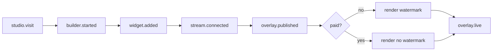
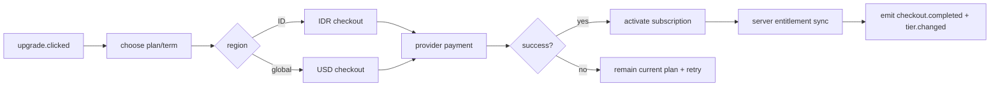
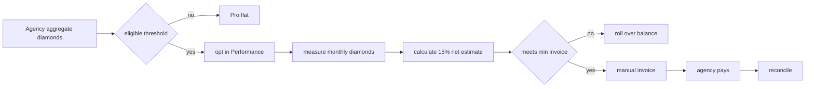

# Revenue Layer Business Requirements — IKI-130

**Author:** Business Analyst
**Parent issue:** IKI-110 Revenue Layer product plan — Free / Pro / Agency execution spec
**Date:** 2026-08-15
**Status:** BA deliverable — ready for PO/Engineering/CTO handoff
**Source material:**
- `docs/revenue-layer-execution-spec-iki-110.md` sections 3–8
- `docs/monetisasi.md`
- `docs/research/r4-pricing-benchmark-wtp.md`

> Scope note: this is a BA requirements document, not an implementation plan. Engineering changes, billing integration, and provider contracting are out of scope for this artifact.

---

## 1. Purpose and Scope

**Purpose:** Translate the IKI-110 revenue-layer product plan into unambiguous business requirements, functional requirements, use cases, business rules, and finance-risk guidance that the PO can decompose into backlog and Engineering can estimate.

**In scope:**
- Free, Pro, and Agency tier entitlements and feature gating
- Watermark strategy and enforcement requirements
- Checkout, subscription, upgrade/downgrade, and pricing display requirements
- Agency workspace, seats, batch deploy, and whitelabel requirements
- Phase 2 Performance gift rev-share eligibility and invoice requirements
- Activation and revenue telemetry requirements
- Provider-option comparison and finance risks

**Out of scope:**
- Implementation or billing integration
- Final provider selection and commercial contracts
- Final finance/tax/pricing validation
- TikTool data-layer billing
- Rev-share implementation in the first billing release

---

## 2. Business Context, Actors, and Goals

### 2.1 Business goals

| Goal | Measure / rationale |
| --- | --- |
| Convert active streamers from Free to Pro | Free→Pro conversion over 30 days |
| Preserve Free as an acquisition channel | Free users can still publish useful overlays |
| Sell Agency as an operational multi-account tier | Agencies can connect 2+ streamers and batch publish |
| Keep Studio billing separate from TikTool billing | Studio sells builder/widgets/recap; customer brings own TikTool API key |
| Add Performance rev-share later for high-volume Agency rosters | Phase 2 only, with verified diamond economics |
| Instrument the funnel | Server-side activation events are queryable |

### 2.2 Actors

| Actor | Description |
| --- | --- |
| Visitor | Anonymous or signed-in person browsing `/pricing` or starting the builder |
| Free streamer | Signed-in user on Free tier |
| Pro subscriber | Signed-in user on Pro tier |
| Agency admin / owner | Signed-in user on Agency tier managing multiple streamers and seats |
| Streamer under agency | A TikTok streamer connected to an Agency workspace |
| Payment provider | Stripe, Midtrans, QRIS, Xendit, or merchant-of-record fallback |
| Finance owner | Approves provider terms, tax, prices, and rev-share ledger rules |
| Customer support | Handles failed payments, refunds, plan changes, and disputes |

---

## 3. Business Requirements (BR)

| ID | Business requirement |
| --- | --- |
| BR-01 | The product must offer exactly three self-serve plans: Free, Pro, and Agency. |
| BR-02 | Free must allow the user to create and publish an overlay with the 3 basic widgets, demo mode, community templates, and a visible Stream Studio watermark. |
| BR-03 | Pro must unlock all available widgets, unlimited projects, custom branding, advanced recap analytics, priority templates, and watermark-free publishing. |
| BR-04 | Agency must include all Pro capabilities plus multi-streamer workspaces, team seats, batch deploy, whitelabel, roster rollup, and dedicated onboarding. |
| BR-05 | Pro and Agency must be sold as recurring subscriptions with monthly and 20%-discounted annual billing options. |
| BR-06 | Pricing must support both USD for global users and IDR for Indonesian users, with approved list prices: Pro `$19/Rp 149.000`, Agency `$99/Rp 799.000`; annual Pro `$15/Rp 119.000`, Agency `$79/Rp 649.000`. |
| BR-07 | The primary revenue engine is premium subscription; Performance rev-share is an Agency-only Phase 2 option and must not be available in the initial billing cut. |
| BR-08 | Studio billing must not include, resell, or depend on the customer's TikTool API-key subscription. |
| BR-09 | The product must emit and store activation/revenue events for funnel and conversion analysis. |
| BR-10 | Billing must be isolated behind a provider abstraction so provider choice can change without changing entitlements. |
| BR-11 | Final provider terms, tax treatment, and locked prices require a named finance owner / board sign-off and must remain open assumptions until then. |

---

## 4. Functional Requirements (FR)

### 4.1 Pricing and plan display

- FR-PRICE-01: `/pricing` must show Free, Pro, and Agency side by side with the exact tier matrix from the IKI-110 spec.
- FR-PRICE-02: The pricing page must support a USD/IDR currency or region toggle.
- FR-PRICE-03: The page must show monthly and annual prices, including the effective monthly equivalent and the 20% annual discount.
- FR-PRICE-04: The page must show upgrade CTA events (`upgrade.clicked` → `checkout.started`).
- FR-PRICE-05: A separate Agency/Performance block may explain Phase 2 rev-share, but must not allow checkout or enrollment in Phase 1.
- FR-PRICE-06: IDR pricing is provisional until Van Westendorp validation; the UI must be able to change prices from configuration without code changes.

### 4.2 Entitlement

- FR-ENT-01: A server authority must return an immutable `Entitlement` for every signed-in workspace.
- FR-ENT-02: The entitlement must contain `plan`, `region`, `featureFlags`, `limits`, and `watermark` as normalized fields.
- FR-ENT-03: The entitlement must be server-authoritative; the client must never be the sole source of truth for paid status.
- FR-ENT-04: Entitlement must be available to the builder, widget palette, gallery, publish URL, and overlay renderer.
- FR-ENT-05: The system must preserve the workspace's saved projects when the plan changes.
- FR-ENT-06: TikTool API-key tier is not an input to Studio entitlement.

### 4.3 Watermark

- FR-WM-01: Free preview/builder and published overlays must always render a visible, fixed, small, legible, non-intrusive "Stream Studio" watermark.
- FR-WM-02: Pro and Agency preview/builder and published overlays must render no watermark.
- FR-WM-03: Demo mode must follow the active workspace tier.
- FR-WM-04: The published overlay must receive watermark state from the signed server response; a query parameter alone must not control paid status.
- FR-WM-05: Removing `?config=` or editing client code must not remove a Free-tier watermark in production.
- FR-WM-06: The watermark must be a top-level overlay layer, not dependent on a user-removable widget or template setting.

### 4.4 Feature gating and limits

- FR-GATE-01: Free must allow only the 3 basic widgets: Gift Alert, Goal Bar, Chat Effects.
- FR-GATE-02: Premium widgets must not be addable, duplicatable, or renderable on Free, including from a tampered saved config.
- FR-GATE-03: Free `savedProjects` limit must be `1` and must be enforced server-side.
- FR-GATE-04: Pro and Agency must allow all current 10 widget definitions.
- FR-GATE-05: Agency-only features (multi-streamer, seats, batch deploy, whitelabel, roster rollup) must remain locked for Free and Pro.
- FR-GATE-06: `performanceRevShare` must be `false` for all plans in the first release; it may only become eligible for Agency in Phase 2.
- FR-GATE-07: Gating must be applied at palette/add/render/API layers, not only by hiding marketing text.

### 4.5 Checkout and billing

- FR-CHK-01: Checkout must create or update a recurring subscription for Pro or Agency.
- FR-CHK-02: Checkout must accept monthly or annual billing, applying the approved 20% annual discount.
- FR-CHK-03: Checkout must collect region/currency context and use IDR for Indonesian buyers and USD for global buyers.
- FR-CHK-04: Checkout must support a provider abstraction with at least one global provider and one Indonesian local payment path.
- FR-CHK-05: The system must handle payment success, failure, retry/dunning, and cancellation events without corrupting entitlement state.
- FR-CHK-06: Plan, price, discount, tax, and invoice data must be kept separate from product entitlement logic.
- FR-CHK-07: Checkout completion must emit `checkout.completed` and trigger `tier.changed`.

### 4.6 Upgrade and downgrade

- FR-UD-01: A user must be able to upgrade Free → Pro or Free/Agency → higher plan through checkout.
- FR-UD-02: A user must be able to downgrade Pro → Free or Agency → Pro/Free.
- FR-UD-03: Upgrade must apply the new entitlement within a defined sync window.
- FR-UD-04: Downgrade must preserve saved projects and read-only access where possible, but reapply the lower tier's limits and watermark after the sync window.
- FR-UD-05: Downgrade must not delete projects or widgets; locked premium widgets may be hidden/disabled and their rendered usage blocked.
- FR-UD-06: Plan changes must emit `tier.changed`.

### 4.7 Agency workspace

- FR-AG-01: Agency must support one owner-managed workspace with multiple connected streamers.
- FR-AG-02: Agency must support team seats and role/access assignment.
- FR-AG-03: Agency must support batch deploy of overlays to selected streamers.
- FR-AG-04: Agency must support whitelabel/custom branding plus advanced recap roster rollup.
- FR-AG-05: Agency must not enable Performance rev-share until Phase 2 eligibility is implemented.

### 4.8 Performance rev-share (Phase 2)

- FR-PERF-01: Performance must be an Agency-only option, not available to Free or Pro.
- FR-PERF-02: Eligibility must use aggregate measured diamonds from product telemetry, not client-side UI logs.
- FR-PERF-03: The ledger must calculate 15% of streamer net value, using an estimated conversion labeled as an estimate.
- FR-PERF-04: The system must support invoice rollover when the amount is below the minimum invoice threshold.
- FR-PERF-05: The streamer/agency must be able to switch from Performance to Pro flat at any time.
- FR-PERF-06: No automatic TikTok payout deduction exists; Performance billing must be manual invoice/agreement-based.

### 4.9 Activation and revenue telemetry

- FR-TEL-01: Emit and query the funnel events: `studio.visit`, `builder.started`, `widget.added`, `stream.connected`, `overlay.published`, `overlay.live`, `upgrade.clicked`, `checkout.started`, `checkout.completed`, `tier.changed`.
- FR-TEL-02: Events must come from server-side or product-owned telemetry, not only client logs.
- FR-TEL-03: The client-side diamond counter is telemetry only and must not be used as a billing ledger.
- FR-TEL-04: Metrics must be queryable for activation rate, time to value, Free→Pro conversion, watermark-removal upgrade rate, Pro retention, Agency workspace activation, and Performance eligibility.

---

## 5. Use Cases

### 5.1 Use-case summary

| ID | Use case | Primary actor | Tier |
| --- | --- | --- | --- |
| UC-FREE | Publish a free watermarked overlay | Free streamer | Free |
| UC-PRO | Upgrade to Pro and publish watermark-free overlay | Pro subscriber | Free → Pro |
| UC-AGENCY | Operate multi-streamer Agency workspace | Agency admin | Agency |
| UC-CHECKOUT | Purchase subscription in correct currency/billing term | Visitor / subscriber | Checkout |
| UC-UD | Upgrade or downgrade plan with entitlement sync | Subscriber | All paid |
| UC-PERF | Enroll and settle Performance rev-share | Agency admin | Agency Phase 2 |

### UC-FREE — Publish a free watermarked overlay

- **Preconditions:** Signed-in Free user; entitlement `plan=free`, `allWidgets=false`, `savedProjects=1`, `watermark=true`.
- **Main flow:**
  1. Free user opens builder and adds only Gift Alert, Goal Bar, or Chat Effects.
  2. System allows at most 1 saved project.
  3. User previews overlay; system renders the Stream Studio watermark.
  4. User publishes overlay URL.
  5. System returns a signed overlay config containing `tier=free`, `entitlement`, and `watermark=true`.
  6. Published overlay renders the watermark.
- **Alternative/exception:**
  - User attempts to add a premium widget → system hides/locks and rejects it.
  - User edits config to include a premium widget → overlay rejects or degrades it.
  - User removes `?config=` → overlay still shows watermark.
- **Postcondition:** A usable Free overlay is published with watermark.

### UC-PRO — Upgrade to Pro and publish watermark-free overlay

- **Preconditions:** Free user with existing project; provider/checkout available.
- **Main flow:**
  1. User opens pricing and clicks upgrade.
  2. Checkout collects USD/IDR and monthly/annual choice.
  3. Payment succeeds.
  4. System activates Pro entitlement and emits `checkout.completed` and `tier.changed`.
  5. Entitlement sync returns `allWidgets=true`, `savedProjects=null`, `watermark=false`.
  6. User adds premium widgets and publishes without watermark.
- **Alternative/exception:**
  - Payment fails → remain Free; show retry; no entitlement change.
  - User buys annual → apply 20% discount.
  - User upgrades from Free with >1 attempted project → preserved but lower-tier limit no longer applies.
- **Postcondition:** User is Pro and can publish watermark-free overlays with all widgets.

### UC-AGENCY — Operate multi-streamer Agency workspace

- **Preconditions:** User is Agency subscriber; `multiStreamer`, `batchDeploy`, `whitelabel`, and `advancedRecap` are true.
- **Main flow:**
  1. Agency admin creates a workspace.
  2. Admin invites team seats and connects 2+ streamer accounts.
  3. Admin creates an overlay/template.
  4. Admin batch-deploys the overlay to selected streamers.
  5. Admin applies whitelabel branding.
  6. Admin views roster rollup analytics across connected streamers.
- **Alternative/exception:**
  - Non-Agency user tries multi-streamer/batch/whitelabel → system denies.
  - Performance rev-share attempted in Phase 1 → not offered.
- **Postcondition:** Agency manages multiple streamers from one workspace.

### UC-CHECKOUT — Purchase subscription

- **Preconditions:** Visitor has selected Pro or Agency and has region context.
- **Main flow:**
  1. User chooses plan and billing term (monthly/annual).
  2. System determines region: Indonesia → IDR/local payment; global → USD.
  3. User submits payment through selected provider.
  4. Provider returns success.
  5. System records subscription, invoice, and tax metadata.
  6. System emits `checkout.completed` and `tier.changed`.
- **Alternative/exception:**
  - Provider timeout/unknown status → reconciliation queue; do not activate paid entitlement without confirmed payment.
  - IDR price not yet validated → show provisional price and route finance approval before locking.
  - Payment provider unavailable → fall back to an alternative provider without changing entitlement code.
- **Postcondition:** Subscription active and entitlement applied.

### UC-UD — Upgrade or downgrade plan

- **Preconditions:** User has an active plan.
- **Main flow:**
  1. User requests plan change.
  2. System confirms pricing, proration policy, and effective date.
  3. System updates subscription and recalculates entitlement.
  4. System syncs entitlement within the defined window.
  5. System emits `tier.changed`.
- **Alternative/exception:**
  - Upgrade → higher-tier flags become active immediately or within sync window.
  - Downgrade → lower-tier limits/watermark apply; saved projects are preserved.
  - Downgrade from Agency → multi-streamer/seat/batch/whitelabel access is revoked but data is retained.
- **Postcondition:** User's entitlement matches the new plan.

### UC-PERF — Enroll and settle Performance rev-share (Phase 2)

- **Preconditions:** Agency account is Phase 2 eligible; diamond conversion and finance sign-off complete.
- **Main flow:**
  1. System evaluates aggregate diamond gross for the account/roster.
  2. System determines eligibility against the approved threshold.
  3. Agency opts into Performance instead of flat Pro for eligible roster.
  4. System records monthly diamond telemetry and calculates 15% of net value.
  5. System creates an invoice if amount meets minimum; otherwise rolls over balance.
  6. Agency pays manually by invoice.
  7. Agency may switch back to Pro flat at any time.
- **Alternative/exception:**
  - Account below threshold → not eligible; offer Pro flat.
  - Invoice below minimum → roll over, do not bill.
  - Disputed diamonds/payouts → freeze invoice pending finance resolution.
- **Postcondition:** Eligible Agency has a transparent, estimated-based invoice or rolled-over balance.

---

## 6. Business Process Flows

### 6.1 Free activation and publish flow

### 6.2 Checkout and entitlement flow

### 6.3 Performance rev-share flow (Phase 2)

---

## 7. Business Rules

### 7.1 Entitlement rules

| Rule ID | Rule |
| --- | --- |
| BR-ENT-01 | Every signed-in workspace has exactly one active plan: `free`, `pro`, or `agency`. |
| BR-ENT-02 | Entitlement is server-authoritative; client checks are UX-only and cannot grant paid features. |
| BR-ENT-03 | Free has `savedProjects=1`, `allWidgets=false`, `watermark=true`, and all Agency flags false. |
| BR-ENT-04 | Pro has `savedProjects=null`, `allWidgets=true`, `watermark=false`, and Agency flags false. |
| BR-ENT-05 | Agency has all Pro flags plus `multiStreamer=true`, `batchDeploy=true`, `whitelabel=true`, and Phase 2 `performanceRevShare` only when eligible. |
| BR-ENT-06 | A premium widget in a saved config must be rejected or downgraded if the current workspace is Free. |
| BR-ENT-07 | The customer-supplied TikTool API key is never the source of Studio entitlement. |

### 7.2 Watermark rules

| Rule ID | Rule |
| --- | --- |
| BR-WM-01 | If `watermark=true`, then preview, builder, demo, and published overlay must render the Stream Studio watermark. |
| BR-WM-02 | If `watermark=false`, then preview, builder, demo, and published overlay must render no watermark. |
| BR-WM-03 | Watermark state must come from the signed entitlement/overlay config response, not from an editable URL parameter. |
| BR-WM-04 | A Free-tier overlay must remain watermarked in production even if `?config=` is removed or client code is edited. |
| BR-WM-05 | Watermark placement must be fixed, small, legible, and consistent across templates. |

### 7.3 Upgrade/downgrade rules

| Rule ID | Rule |
| --- | --- |
| BR-UD-01 | Upgrade activates the higher tier only after payment is confirmed by the provider/webhook. |
| BR-UD-02 | Upgrade must apply within the defined entitlement sync window. |
| BR-UD-03 | Downgrade must reapply the lower tier's limits and watermark after the sync window. |
| BR-UD-04 | Downgrade must preserve saved projects and workspace data; it must not delete user content. |
| BR-UD-05 | Downgrade from Agency must revoke multi-streamer, seats, batch deploy, whitelabel, and roster rollup access. |
| BR-UD-06 | A failed payment or lapsed subscription must fall back to Free entitlements, not silently retain paid features. |
| BR-UD-07 | Annual billing discount is exactly 20% off the monthly list price. |

### 7.4 Performance rev-share eligibility rules

| Rule ID | Rule |
| --- | --- |
| BR-REV-01 | Performance is not available in the first release and is only available to eligible Agency accounts in Phase 2. |
| BR-REV-02 | Eligibility requires aggregate gross diamonds of at least 100.000/month per account, or at least 50.000/month when aggregated per agency in one invoice. |
| BR-REV-03 | Rev-share is 15% of streamer **net** value, equivalent to approximately 7.5% of gross under the working conversion assumption. |
| BR-REV-04 | The working diamond conversion is `1 diamond ≈ US$0,005 gross / ≈ US$0,0025 net` and must be labeled as an estimate until confirmed with real payouts. |
| BR-REV-05 | Invoices below the minimum threshold are rolled over, not billed. |
| BR-REV-06 | Performance billing is manual invoice/agreement-based; no automatic TikTok payout deduction exists. |
| BR-REV-07 | The client-side diamond counter is telemetry only and cannot be the billing ledger. |
| BR-REV-08 | An eligible Performance customer may switch to Pro flat at any time. |

---

## 8. Provider-Option Comparison and Finance Risks

### 8.1 Provider comparison

| Provider | Fit | Strengths | Finance/operational risks |
| --- | --- | --- | --- |
| **Stripe Billing** | Global USD cards and recurring subscriptions | Strong recurring billing, webhooks, dunning, invoicing | Tax/VAT compliance must be configured; may not be the best IDR local checkout; Indonesia card coverage can be lower than local rails |
| **Midtrans** | Indonesia cards, e-wallets, bank transfer, local IDR checkout | Strong Indonesian payment UX and settlement options; enables local pricing | Local commercial/approval terms needed; refunds, chargebacks, and reconciliation must be owned; provider lock-in if not abstracted |
| **QRIS via Midtrans/Xendit** | Indonesia mobile-first instant payments | High conversion for Indonesian streamers; should be presented in IDR checkout | QRIS transaction limits and settlement timing; reconciliation across e-wallets; should not replace card coverage, only complement it |
| **Xendit** | Indonesia + regional alternative | Viable fallback if Midtrans terms/approval fail; supports local rails and payouts | Same local compliance/tax/reconciliation burden; commercial terms must be validated |
| **Lemon Squeezy / Paddle (fallback)** | Merchant-of-record if own MoR is delayed | Reduces tax/compliance and merchant-of-record burden | Higher fees; less control over checkout branding/customer data; regional support and pricing need verification |

**Recommended architecture for CTO review:** start with Stripe global + Midtrans/QRIS IDR behind a provider abstraction, with Xendit as local fallback and Lemon Squeezy/Paddle as merchant-of-record fallback. Keep plan, price, discount, tax, and invoice data separate from entitlement.

### 8.2 Finance risks to resolve before Phase 2

| Risk | Impact | Owner / action |
| --- | --- | --- |
| CFO vacancy | Provider terms, tax, and final price lock are not owned | CEO/board must name finance owner; do not block product spec |
| IDR price not validated | Price may be wrong for Indonesian WTP | UX Researcher runs Van Westendorp IDR/USD before locking |
| Diamond conversion is Medium confidence | Rev-share ledger may be wrong | Confirm with 3–5 real streamer payout statements before Performance |
| Manual rev-share invoicing cost | Can erase margin at low diamond volumes | Enforce threshold and rollover rules; finance validates collection cost |
| Client-side diamond telemetry | Not auditable as a ledger | Server-side/product-owned ledger and audit trail required |
| Provider fee/tax variability | Margin and compliance exposure | Finance validates Stripe/Midtrans/QRIS/Xendit fees and tax obligations |
| Local payment failure/reconciliation | Delayed entitlement or revenue leakage | Payment status reconciliation queue and provider webhook idempotency |
| Chargebacks/disputes | Revenue loss and support load | Define refund, dispute, and lapse policies before live billing |

---

## 9. Edge Cases

1. Free user tampers with a saved config to include a premium widget.
2. Free user removes `?config=` or edits overlay client code to strip watermark.
3. Payment succeeds on provider side but webhook is delayed or duplicated.
4. Payment is successful but entitlement sync fails.
5. User downgrades from Agency with multiple streamers, seats, batch schedules, and whitelabel assets.
6. User downgrades with more than 1 saved project from Pro/Agency to Free.
7. Indonesian user pays IDR while account region is incorrectly GLOBAL.
8. User changes currency/region mid-checkout.
9. Annual subscription renews while provider fee or tax settings change.
10. User attempts Performance in Phase 1 or from Free/Pro in Phase 2.
11. Agency aggregate diamonds fall below threshold mid-month.
12. Performance invoice is below minimum; balance must roll over without losing data.
13. Diamond conversion estimate is revised after a prior invoice.
14. Customer cancels subscription and returns later; previous projects and tier history must be recoverable.
15. Two team members concurrently edit the same Agency workspace.
16. Payment provider outage prevents checkout; system must fail safe and preserve current entitlement.

---

## 10. Acceptance-Criteria Mapping

| IKI-130 acceptance criterion | Covered by |
| --- | --- |
| Business rules cover entitlement, watermark, upgrade/downgrade, and rev-share eligibility | BR-ENT-01…07, BR-WM-01…05, BR-UD-01…07, BR-REV-01…08 |
| Use cases cover Free, Pro, Agency, checkout, and Performance workflows | UC-FREE, UC-PRO, UC-AGENCY, UC-CHECKOUT, UC-PERF, UC-UD |
| Provider comparison includes Stripe/Midtrans/QRIS/Xendit/fallback | Section 8.1 |

---

## 11. Handoff and Next Actions

- **PO:** decompose `FR-*` and `UC-*` into user stories with Gherkin acceptance criteria.
- **CTO/Engineering:** feasibility review of FR-ENT/WM/GATE touchpoints, entitlement sync window, and provider abstraction.
- **Finance owner / CEO board:** resolve provider terms, tax, IDR price validation, and rev-share diamond conversion before Phase 2.
- **BA status:** complete for IKI-130; artifact delivered to IKI-110.
